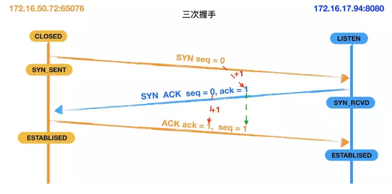
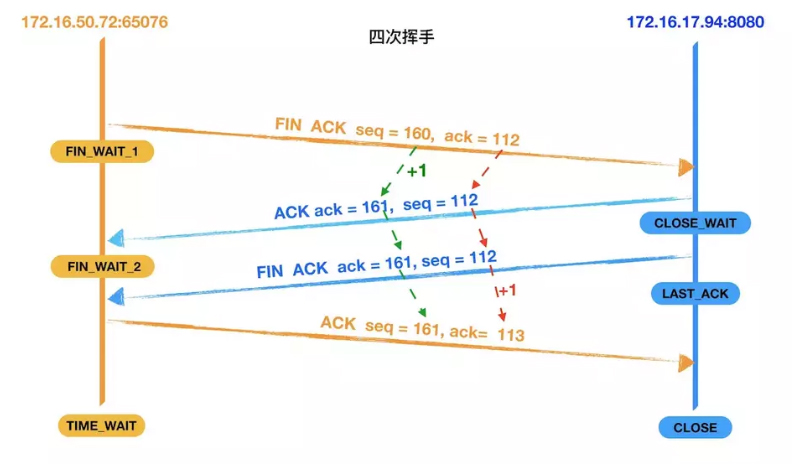

### 什么是TCP/IP

不同的计算机系统，就好像语言不同的两个人互相见了面，完全不能交流信息。
因而他们需要定义一些共通的东西来进行交流，TCP/IP就是为此而生。

TCP/IP不是一个协议，而是一个协议族的统称。
里面包括了IP协议，IMCP协议，TCP协议，以及我们更加熟悉的http、ftp、pop3协议等等。

### TCP/IP 协议分层模型

>物理层
    
    将二进制的0和1和电压高低，光的闪灭和电波的强弱信号进行转换

>数据链路层
    
    代表驱动

>网络层
    
    使用 IP 协议，IP 协议基于 IP 转发分包数据
    IP 协议是个不可靠协议，不会重发
    IP 协议发送失败会使用ICMP 协议通知失败
    ARP 解析 IP 中的 MAC 地址，MAC 地址由网卡出厂提供
    IP 还隐含链路层的功能，不管双方底层的链路层是啥，都能通信

>传输层

    通用的 TCP 和 UDP 协议
    TCP 协议面向有连接，能正确处理丢包，传输顺序错乱的问题，
    但是为了建立与断开连接，需要至少7次的发包收包，资源浪费
    UDP 面向无连接，不管对方有没有收到，如果要得到通知，需要通过应用层

>会话层以上分层

    TCP/IP 分层中，会话层，表示层，应用层集中在一起
    网络管理通过 SNMP 协议

应用层(http、ftp、smtp) -->传输层(TCP、UDP)-->网络层(IP)-->数据链路层

OSI七层模型和TCP/IP五层模型

 

### TCP/IP的三次握手与四次挥手
>三次握手

为了方便描述我们将主动发起请求的172.16.50.72:65076 主机称为客户端，
将返回数据的主机172.16.17.94:8080称为服务器。

第一次握手: 建立连接。客户端发送连接请求，发送SYN报文，将seq设置为0。
           然后，客户端进入SYN_SEND状态，等待服务器的确认。

第二次握手: 服务器收到客户端的SYN报文段。需要对这个SYN报文段进行确认，发送ACK报文，将ack设置为1。
           同时，自己还要发送SYN请求信息，将seq为0。
           服务器端将上述所有信息一并发送给客户端，此时服务器进入SYN_RECV状态。

第三次握手: 客户端收到服务器的ACK和SYN报文后，进行确认，然后将ack设置为1，seq设置为1，
           向服务器发送ACK报文段，这个报文段发送完毕以后，客户端和服务器端都进入ESTABLISHED状态，完成TCP三次握手。

>四次挥手

第一次挥手：客户端向服务器发送一个FIN报文段，将设置seq为160和ack为112，;
           此时，客户端进入 FIN_WAIT_1状态,这表示客户端没有数据要发送服务器了，请求关闭连接;
第二次挥手：服务器收到了客户端发送的FIN报文段，向客户端回一个ACK报文段，ack设置为1，seq设置为112;
           服务器进入了CLOSE_WAIT状态，客户端收到服务器返回的ACK报文后，进入FIN_WAIT_2状态;

第三次挥手：服务器会观察自己是否还有数据没有发送给客户端，如果有，先把数据发送给客户端，
           再发送FIN报文；如果没有，那么服务器直接发送FIN报文给客户端。
           请求关闭连接，同时服务器进入LAST_ACK状态;

第四次挥手：客户端收到服务器发送的FIN报文段，向服务器发送ACK报文段，将seq设置为161，
           将ack设置为113，然后客户端进入TIME_WAIT状态;服务器收到客户端的ACK报文段以后，
           就关闭连接;此时，客户端等待2MSL后依然没有收到回复，则证明Server端已正常关闭，
           客户端也可以关闭连接了。

### TCP与UDP的区别

1、TCP面向连接（如打电话要先拨号建立连接）;UDP是无连接的，即发送数据之前不需要建立连接

2、TCP提供可靠的服务。也就是说，通过TCP连接传送的数据，无差错，不丢失，不重复，且按序到达;
   UDP尽最大努力交付，即不保证可靠交付

3、TCP面向字节流，实际上是TCP把数据看成一连串无结构的字节流;UDP是面向报文的

>例，TCP连接就像是打电话，两者之间必须有一条不间断的通路，数据不到达对方，对方就一直在等待，
除非对方直接挂断电话。先说的话先到，后说的后到，有顺序。

4、每一条TCP连接只能是点到点的;UDP支持一对一，一对多，多对一和多对多的交互通信

5、TCP首部开销20字节;UDP的首部开销小，只有8个字节

6、TCP的逻辑通信信道是全双工的可靠信道，UDP则是不可靠信道
