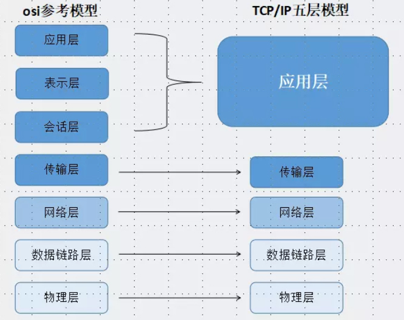

TCP与UDP概要汇总
    [TCP/IP协议分层模型](#Hierarchical Model)
    [TCP的三次握手建立连接与四次挥手断开连接](#Three handshakes)
    [TCP与UDP的区别](#difference)
    [TCP优缺点](#TCP Disadvantages)
    [UDP优缺点](#UDP Disadvantages)
---

不同的计算机系统，就好像语言不同的两个人互相见了面，完全不能交流信息。
因而他们需要定义一些共通的东西来进行交流，TCP/IP就是为此而生。

TCP/IP不是一个协议，而是一个协议族的统称。
里面包括了IP协议，IMCP协议，TCP协议，以及我们更加熟悉的http、ftp、pop3协议等等。

TCP协议概要：

    Transmission Control Protocol，传输控制协议
    面向连接的协议
    需要三次握手建立连接
    需要四次挥手断开连接
    TCP报头最小长度：20字节

UDP协议概要：

    User Data Protocol，用户数据包协议
    面向无连接的协议
    UDP报头只有8字节
    UDP包最大为65507字节，约64K
---
### <a name='Hierarchical Model'>TCP/IP协议分层模型</a>

>物理层
    
    将二进制的0和1和电压高低，光的闪灭和电波的强弱信号进行转换

>数据链路层
    
    代表驱动

>网络层
    
    使用 IP 协议，IP 协议基于 IP 转发分包数据
    IP 协议是个不可靠协议，不会重发
    IP 协议发送失败会使用ICMP 协议通知失败
    ARP 解析 IP 中的 MAC 地址，MAC 地址由网卡出厂提供
    IP 还隐含链路层的功能，不管双方底层的链路层是啥，都能通信

>传输层

    通用的 TCP 和 UDP 协议
    TCP 协议面向有连接，能正确处理丢包，传输顺序错乱的问题，
    但是为了建立与断开连接，需要至少7次的发包收包，资源浪费
    UDP 面向无连接，不管对方有没有收到，如果要得到通知，需要通过应用层

>会话层以上分层

    TCP/IP 分层中，会话层，表示层，应用层集中在一起
    网络管理通过 SNMP 协议

应用层(http、ftp、smtp) -->传输层(TCP、UDP)-->网络层(IP)-->数据链路层

OSI七层模型和TCP/IP五层模型：

 

### <a name='Three handshakes'>TCP的三次握手建立连接与四次挥手断开连接</a>
>三次握手建立连接

为了方便描述我们将主动发起请求的172.16.50.72:65076 主机称为客户端，
将返回数据的主机172.16.17.94:8080称为服务器。

* 第一次握手: 建立连接。客户端发送连接请求，发送SYN报文，将seq设置为0。
           然后，客户端进入SYN_SEND状态，等待服务器的确认。

* 第二次握手: 服务器收到客户端的SYN报文段。需要对这个SYN报文段进行确认，发送ACK报文，
           将ack设置为1。同时，自己还要发送SYN请求信息，将seq为0。
           服务器端将上述所有信息一并发送给客户端，此时服务器进入SYN_RECV状态。

* 第三次握手: 客户端收到服务器的ACK和SYN报文后，进行确认，然后将ack设置为1，seq设置为1，
           向服务器发送ACK报文段，这个报文段发送完毕以后，客户端和服务器端都进入ESTABLISHED状态，
           完成TCP三次握手。
---
    客户端发送：SYN = 1, SEQ = X, 端口号
    服务器回复：SYN = 1, ACK = X + 1, SEQ = Y
    客户端发送：ACK = Y + 1, SEQ = X + 1
    确认应答信号ACK = 收到的SEQ + 1。 连接建立中，同步信号SYN始终为1。连接建立后，同步信号SYN=0。

>四次挥手断开连接

* 第一次挥手：客户端向服务器发送一个FIN报文段，将设置seq为160和ack为112，;
           此时，客户端进入 FIN_WAIT_1状态,这表示客户端没有数据要发送服务器了，请求关闭连接;

* 第二次挥手：服务器收到了客户端发送的FIN报文段，向客户端回一个ACK报文段，ack设置为1，seq设置为112;
           服务器进入了CLOSE_WAIT状态，客户端收到服务器返回的ACK报文后，进入FIN_WAIT_2状态;

* 第三次挥手：服务器会观察自己是否还有数据没有发送给客户端，如果有，先把数据发送给客户端，
           再发送FIN报文；如果没有，那么服务器直接发送FIN报文给客户端。
           请求关闭连接，同时服务器进入LAST_ACK状态;

* 第四次挥手：客户端收到服务器发送的FIN报文段，向服务器发送ACK报文段，将seq设置为161，
           将ack设置为113，然后客户端进入TIME_WAIT状态;服务器收到客户端的ACK报文段以后，
           就关闭连接;此时，客户端等待2MSL后依然没有收到回复，则证明Server端已正常关闭，
           客户端也可以关闭连接了。
---
    A向B提出停止连接请求，FIN = 1
    B收到，ACK = 1
    B向A提出停止连接请求，FIN = 1
    A收到，ACK = 1

### <a name='difference'>TCP与UDP的区别</a>

| TCP                   | UDP                     |
| --------------------- |:-----------------------:|
| TCP面向有链接的通信服务 |      UDP面向无连接的通信服务 |
| TCP提供可靠的通信传输 |        UDP不可靠,会丢包 |
| TCP保证数据顺序 |             UDP不保证 |
| TCP数据无边界 |               UDP有边界 |
| TCP速度快 |                   UDP速度慢 |
| TCP面向字节流 |               UDP面向报文 |
| TCP一对一 |                   UDP可以一对一，一对多 |
| TCP报头至少20字节 |           UDP报头8字节 |
| TCP有流量控制，拥塞控制 |      UDP没有 |

面向字节流的话，虽然应用程序和TCP的交互是一次一个数据块（大小不等），
但TCP把数据看成是一连串的无结构的字节流。TCP有一个缓冲，当应用程序传送的数据块太长，
TCP就可以把它划分短一些再传送。如果应用程序一次只发送一个字节，
TCP也可以等待积累有足够多的字节后再构成报文段发送出去。

面向报文的传输方式是应用层交给UDP多长的报文，UDP就照样发送，即一次发送一个报文。
因此，应用程序必须选择合适大小的报文。若报文太长，则IP层需要分片，降低效率。
UDP对应用层交下来的报文，既不合并，也不拆分，而是保留这些报文的边界。
这也就是说，应用层交给UDP多长的报文，UDP就照样发送，即一次发送一个报文。 

### <a name='TCP Disadvantages'>TCP优缺点</a>
优点：
* 可靠，稳定 
    
    1、传递数据前，会有三次握手建立连接
     
    2、传递数据时，有确认、窗口、重传、拥塞控制
     
    3、传递数据后，会断开连接节省系统资源

缺点：
* 传输慢，效率低，占用系统资源高 
    
    1、传递数据前，建立连接需要耗时
     
    2、传递数据时，确认、重传、拥塞等会消耗大量时间以及CPU和内存等硬件资源
    
* 易被攻击。因为有确认机制，三次握手等机制，容易被人利用，实现DOS 、DDOS攻击 

#### 如何保证接收的顺序性

>TCP协议使用SEQ和ACK机制保证了顺序性 TCP的每个报文都是有序号的。确认应答信号ACK=收到的SEQ+1

### <a name='UDP Disadvantages'>UDP优缺点
优点：
* 传输速率快 

    1、传输数据前，不需要像TCP一样建立连接
 
    2、传输数据时，没有确认、窗口、重传、拥塞控制等机制

* 较安全。由于没有了TCP的一些机制，被攻击者利用的漏洞就少了

缺点：

* 不可靠，不稳定。由于没有了TCP的机制，在数据传输时如果网络不好，很可能丢包

#### 用UDP协议通讯时怎样得知目标机是否获得了数据包

仿造TCP的做法，每发一个UDP包，都在里面加一个SEQ序号，接收方收到包后，将SEQ序号回复给发送方。
如果发送方在指定时间以内没有收到回应，说明丢包了

### UDP包的最大是多少?

>65507字节(byte)约等于64K
 
为什么最大是65507字节?
因为udp包头有2个字节用于记录包体长度. 2个字节可表示最大值为: 2^16-1=64K-1=65535
ip包头占20字节,udp包头占8字节, 65535-IP包头(20)-UDP包头(8)＝65507字节。

如果要发送的udp报文大于65507怎么办?
需要在应用层由开发者自己分片发送。分片的粒度最大65507字节。
系统的sendto函数是不支持大于65507字节的单包发送的，如果发送数据长度大于该值，则函数会返回错误

经测试,局域网环境下,UDP包大小为1024*8,速度达到2M/s,丢包情况理想.
外网环境下,UDP包大小为548,速度理想,丢包情况理想.

### TCP包的最大是多少?

用TCP协议发送时，由于TCP是数据流协议，因此不存在包大小的限制（暂不考虑缓冲区的大小）。
这是指在用send函数时，数据长度参数不受限制。
而实际上，所指定的这段数据并不一定会一次性发送出去，
如果这段数据比较长，会被分段发送，如果比较短，可能会等待和下一次数据一起发送。

### 为什么UDP比TCP快
* TCP需要三次握手
* TCP有拥塞控制，控制流量等机制

### 为什么TCP比UDP可靠
* TCP是面向有连接的，建立连接之后才发送数据；而UDP则不管对方存不存在都会发送数据。
* TCP有确认机制，接收端每收到一个正确包都会回应给发送端。超时或者数据包不完整的话发送端会重传。
  UDP没有。因此可能丢包。
  
### 什么时候使用TCP

当对网络通讯质量有要求的时候，比如：整个数据要准确无误的传递给对方，
这往往用于一些要求可靠的应用，比如HTTP、HTTPS、FTP等传输文件的协议，POP、SMTP等邮件传输的协议。
在日常生活中，常见使用TCP协议的应用如下：浏览器，用的HTTP FlashFXP，用的FTP Outlook，
用的POP、SMTP Putty，用的Telnet、SSH QQ文件传输

### 什么时候应该使用UDP

当对网络通讯质量要求不高的时候，要求网络通讯速度能尽量的快，这时就可以使用UDP。
比如，日常生活中，常见使用UDP协议的应用如下：QQ语音 QQ视频 TFTP

### TCP无边界，UDP有边界
TCP无边界：客户端分多次发送数据给服务器，若服务器的缓冲区够大，
那么服务器端会在客户端发送完之后一次性接收过来，所以是无边界的；

UDP有边界：客户端每发送一次，服务器端就会接收一次，
也就是说发送多少次就会接收多少次，因此是有边界的。